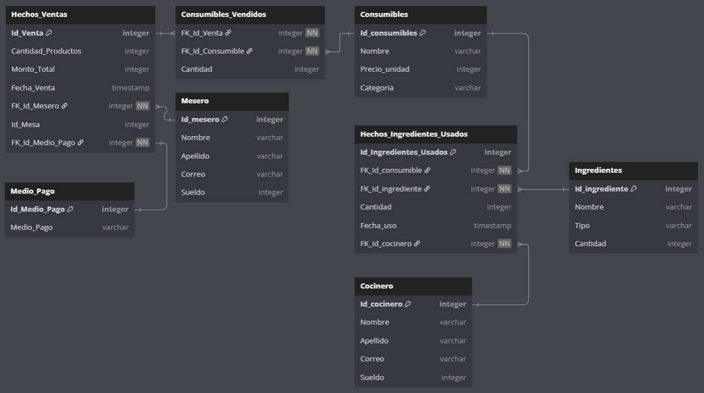

# INFO133-Grupo_3-Restaurante
Trabajo grupal semestral asignatura base de datos

## Idea principal

Sistema de base de datos que permita registrar las ventas realizadas en un restaurante, con sus detalles (mesero a cargo, pedido, precio, personas por mesa, etc.) y proveer un servicio de inventario de los ingredientes disponibles.

## Requerimientos

- Recuento e inventario de los ingredientes
- Registro de los pedidos, las ventas y las boletas de estas
- Registro de los ingredientes usados para cada consumible del menú
- Información de los empleados, incluyendo cocineros y meseros
- Menú dinámico del restaurante, donde se pueda agregar consumibles y quitarlos

## Objetivo

Mantener un sistema de gestión de un restaurante, para los pedidos, empleados, ventas e inventario. Para ello, el sistema tendrá las siguientes funcionalidades:
- Cada trabajador tendrá acceso a una interfaz de inicio de sesión donde podrá
    > Como mesero, acceder a un sistema de gestión de mesas y sus pedidos.
     
    > Como administrador o mánager, acceder al registro de inventario, además de poder ver resúmenes estadísticos mediante gráficos

## Modelo base de datos de análisis

Creado en [dbdiagram.io](https://dbdiagram.io/d/RestaurantDB-V2-0-6818e8e31ca52373f588d4c4)

## Como ejecutar el programa

Para ejecutar el programa, abra una terminal en la carpeta del proyecto. Ya dentro de este, deberá escribir:
> python analisis.py {año}

Donde el argumento 'año' será el año donde se desean generar datos y agrupar su información en los gráficos.
_La parte de 'python' podrá cambiar según la version de python que este instalada en el dispositivo_

## Integrantes:
- Eduardo Montecinos
- Rodrigo González
- Benjamín González
- Matías Soto
- Matías Toledo
