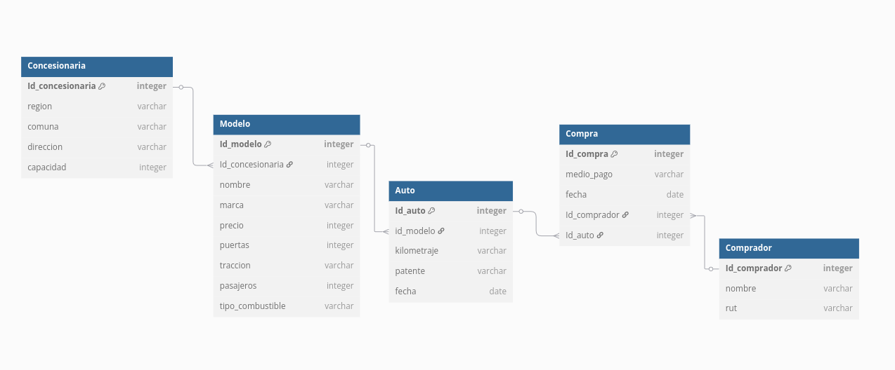
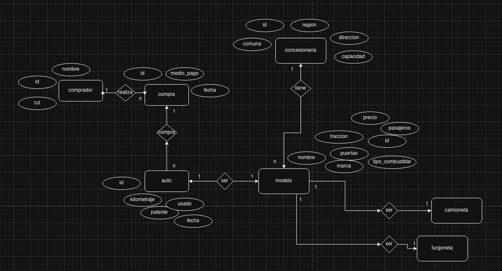

# Diagrama Entidad-Relación Grupo 5

## Comentario

Se describen los requisitos de forma algo muy general, pero es suficiente para crear modelos correctamente

## Diagrama dbdiagram.io

## Diagrama draw.io

